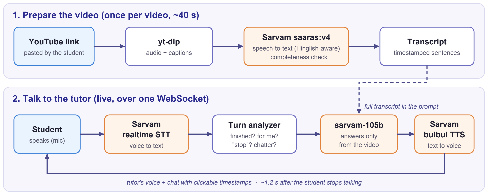

# Video Tutor Agent

Paste a YouTube link, then **talk** to a tutor that answers **only from that video**, in English, Hindi, Hinglish or other Indian languages. Built entirely on **Sarvam AI**.

## Demo

**Talking to the tutor:** interruptions, background chatter, Hinglish, out-of-scope questions

[▶ Watch the tutor demo](https://drive.google.com/file/d/1h74wq6Zzo-GDLBxNQ62-lXe1JhKVrWAd/view?usp=drive_link)


**Transcribing a new video:** paste a link, and it's ready to talk about in ~40 s

[▶ Watch the transcription demo](https://drive.google.com/file/d/1LBWFSGriv9oKw8u1EKP_h062X-kISW4X/view?usp=drive_link)


## What it does

- **YouTube link → transcript:** audio is transcribed with Sarvam `saaras:v4` (code-mix aware), with timestamps at sentence level.
- **Hands-free voice tutor:** just talk. You can interrupt it at any time, and it replies about 1.2 s after you stop.
- **Answers only from the video:** timestamp citations you can click; "not covered in this video" when it isn't.
- **Real-room aware:** waits while you think, ignores chatter, TV and music, and stops when you say "ruko" / "stop".
- **Multilingual:** replies in the language of your latest question (English, Hindi, Hinglish, Telugu…).

## Architecture



Sarvam models: `saaras:v4` (transcripts) · `saaras:v3-realtime` (live speech) · `sarvam-105b` (answers) · `bulbul:v3` (voice).

One-page summary: [docs/Video_Tutor_Agent.pdf](docs/Video_Tutor_Agent.pdf)

## Run it

```bash
cd server
npm install
cp .env.example .env    # add your SARVAM_API_KEY
npm run dev             # open http://localhost:8787 in Chrome
```

Three videos come pre-loaded, so you can start talking right away.
